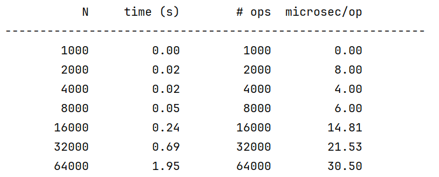
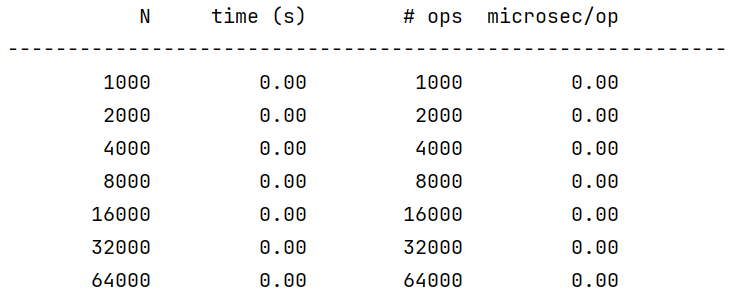
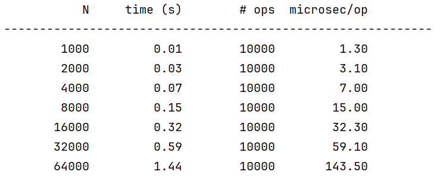

# Timing Tests, Randomized Comparison Test

这个 lab 是在为 `SLList` 和 `AList` 写一些计时测试

主要是在学习一个 Debug 新特性：条件断点，恢复和执行断点


## Timing Tests

### Timing ALists

在 Chap2 中可以学到不同的空间扩展策略在时间复杂度的表现会完全不同，本节就是在体现这点

`AList` 使用糟糕的空间分配策略，我的任务就是输出一个运行信息相关的表格

- N：`AList` 数据结构的大小
- `time(s)`：完成所有操作需要的总时间
- `# ops`：在计时实验中间执行 `addLast()` 的次数
- `microsec/op`：完成一次 `addLast()` 所需要的平均时间

实验提供的 `starter code` 已经提供了表的绘制方法，我要做的就是确定参数之后传参

看来我的电脑性能确实还行，几乎一瞬间就出结果了hhhh，不愧是 i9 芯片




#### Reconstruction AList

现在修改 `AList` 来让时间开销变小，其实就是修改空间分配策略 

这里的 SPEC 让尝试一些不同的策略看看结果，但是我懒就不试了，直接用最有方式




### Timing SLList

在上面的测试中，主要是查看了构造对象的开销，但是已经声明的对象在运行时的开销我们也是要关注的

这里的测试主要是说明如何通过测试判断当前数据结构的方法执行是否和问题规模成正比

这个跑起来还挺卡的




## Randomized Comparison Tests

这里介绍了一种测试方式：**对比测试** 

其中一种方法是被公认为几乎完全正确的，另一种是正在开发但是还没有被验证过的方式

例如本节的实例代码 `AListNoResizing` 由于极其简单所以被认为几乎不可能出问题，对比的是 `BuggyAList` 类型，会根据有效数据的占比调整所需的空间大小


### Write JUnit

SPEC 提示我们写一个 `testThreeAddThreeRemove()` 这样的测试用例，同时作用在 `AListNoResizing` 类和 `BuggyAList` 类，然后检查二者在执行后的结果是否相同

- `addLast()` 执行 3 次
- `removeLast()` 执行 1 次，检查是否相同
- `removeLast()` 执行 1 次，检查是否相同
- `removeLast()` 执行 1 次，检查是否相同

SPEC 说这个测试用例是可以通过（那你告诉我干什么(‾◡◝)


Q：这里有个问题就是如何判断二者相等（共同使用的 `Item[]` 是 `private` 权限

给出 `solution` 就是避开了这点，侧面比较的


### Randomized Function Calls

理论上是可以通过缜密的设计最终找到这个 bug，但是，一个备用并且与之互补的方法是大量的随机测试

```java
AListNoResizing<Integer> L = new AListNoResizing<>();

int N = 500;
for (int i = 0; i < N; i += 1) {
    int operationNumber = StdRandom.uniform(0, 2);
    if (operationNumber == 0) {
        // addLast
        int randVal = StdRandom.uniform(0, 100);
        L.addLast(randVal);
        System.out.println("addLast(" + randVal + ")");
    } else if (operationNumber == 1) {
        // size
        int size = L.size();
        System.out.println("size: " + size);
    }
}
```


### Conditional Breakpoints

本节引入两个重要功能：`resume` 和 `conditional breakpoints` 

注意在 `line_x` 打上的断点，无法判断该行的执行情况（必须在下一行才能体现）


### Adding More Randomized Calls

现在修改 `testRandom()` 支持两个功能 `getLast()` 和 `removeLast()` （提示需要修改随机数的范围


### Adding Randomized Comparisons

目前 `restRandom()` 的测试只发生在已经正确的类上，现在要支持对测试类的修改

只要随机测试的基数足够大，总能发现错误的

不过，SPEC 里提到，大量的随机测试并不能作为精心设计的测试的完全替代品，毕竟只是随机不是全部

（随机性测试更多的作为一种补充性测试


### Fix Bug

传参出了问题，简单改一下就好了


# Done!

比我想象的简单的多啊2333


