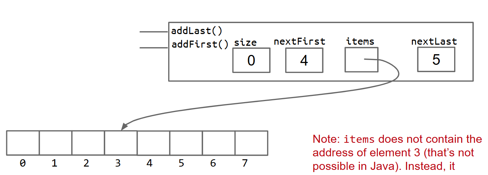

# Data Structures

这个项目的目的是构造一个双端队列，分别使用两种实现方式，数组和链表

这个项目可以被大致分为两部分：数据部分结构实现部分和应用部分

- 数据结构实现部分：
  - 新建 `ArrayDeque.java` 文件和 `LinkedListDeque.java` 文件
  - 需要自己针对这两个文件进行大量的随机测试


- 数据结构应用部分：
  - 新建 `MaxArrayDeque.java` 文件，终能让 `Guitar Hero` 发出电子音
  - 要为 `MaxArrayDeque` 写测试，项目只会提供针对 `Guitar Hero` 的测试


#### 项目管理

这个项目通过包管理来区分不同的运行逻辑

`Java package`：Java 类的集合，为了实现某个共同的目标而被放在一起，通过在类文件的最顶端声明

```java
package deque;
// 后续执行 import 后可以以更简洁的方式调用包中的方法
```


#### The Deque API

Deque：double ended queue 的缩写	可以在两个方向上进行扩容和减容

- `public void addFirst(T item)`：在队首添加元素
- `public void addLast(T item)`：队尾添加
- `public boolean isEmpty()`：如果队列为空则返回 True
- `public int size()`：返回队列长度
- `public void printDeque()`：打印
- `public T removeFirst()`：移除存在的头元素，否则返回 null
- `public T removeLast()`：移除存在的尾元素
- `public T get(int index)`：获取特定位置的元素


相对而言两个相对特殊的方法：

- `public Iterator<T> iterator()`：返回可迭代对象
- `public boolean equals(Object o)`：判断队列内容是否相同，需要用到 `isinstance of()` 


数列必须是泛型实现


## Project Tasks

### Q1: Linked List Deque

要求实现 `LinkedListDeque`，需要满足一些要求：

- `add()` 和 `remove()` 不能包含任何循环和递归，必须是常量级的复杂度
- `get()` 必须使用循环
- `size()` 必须是常量级

总之就是声明数据结构必须是用链表实现的，空间的分配等于有效空间的分配，实现 `Deque API` 要求的方法

还有额外的两个方法：

- `public LinkedListDeque()`：创建一个新链表
- `public T getRecursive(int index)`：用递归实现 `get()` 

> 提示考虑哨兵和双向循环链表


### Q2: Array Deque

同样的结果但是用数组的数据结构实现，注意数组泛型要用 `Object[]` 表示

数组的空间分配问题：

对于有效长度超过 16 的数组，有效空间分配控制在至少 25% 以上（如果移除元素导致占比变化，需要重新分配空间

SPEC 提示我们这个数据结构要使用循环数组，记录首元素和尾元素所在的下标位置

其实就是说最好创造一个双向增长的数列，最初的元素存储不能从首位开始



这个写起来比我想得麻烦的多啊...(///￣皿￣)○～


### Test1

对 `ArrayDeque` 的执行出现了一些错误，主要是边界情况没有考虑完整

- 在移除元素的时候没有考虑列表本身为空的情况，而且 `isEmpty()` 的结果写反了
- 基础的 `addLast()` 功能表现出越界的行为，没有意识到首元素指针和尾元素指针的关系，应该形成一个环，即使下标位置不够用，但是物理层面的数组空间是够的，应该用**取余的操作**找到真正的下标位置
  - 附加修改打印函数


### Test2

第二次提交能看到 `get()` 和 `removeFirst()` 方法有问题

- `get()`：那这个题目的意思应该是基于物理存储的下标
- `removeFirst()` 和 `removeLast()` 其实是没有改...

改完了想提交结果使用次数用完了呜呜呜呜呜呜，只能等 8 个小时


