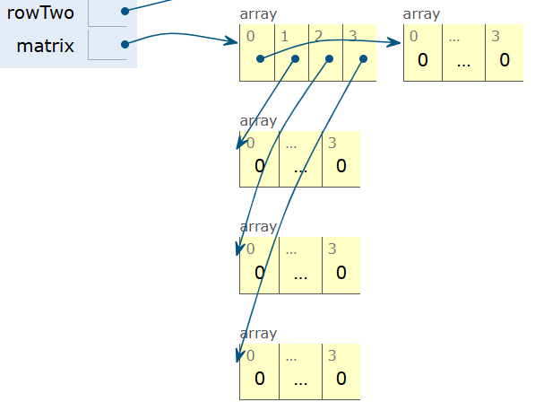

# DLList

这一节主要是对前面链表的讨论进行一个总结，并且开始学习列表的基础内容


#### addLast

把这个方法改的更有效率，因为原本的实现方法需要遍历完整的列表再在末尾添加元素

想改快也简单，新声明一个永远指向最后一个元素的指针

> 这样可以改快对最后一个元素的处理，如果想删除最后元素还是要遍历，主要是得改指针


### #10 Looking Back

如何让删除最后一个元素也变得很快呢，最粗暴的方式就是转变为双向（循环）链表（其他的想不到了

这里的讲解没有涉及具体的代码实现，是留到 Proj1 去做的

**法一：**

在末尾也设置一个 `sentinel` 每次添加结点都发生在两个 `sentinel` 中间

**法二：**双向循环链表

实践上最好的代码结构


### #11 Sentinel Upgrade

这里就是说了说双向循环链表的概念


## Generic DLLists

普遍化链表，目前的链表实际只能储存整数类型，实际上有各种各样数据类型的链表（泛型概念）

介绍一下 Java 的泛型语法（编译型语言的优势）

```java
// 泛型的定义
public class DLList<GenericType> {
    private IntNode sentinel;
    ...;
    
    public static class IntNode {
        public Intnode prev;
        public GenericType item;
        public IntNode next;
    }
}
```

```java
// 泛型的使用声明
DLList<String> d1 = new DLList<>("test");	// 后面的 <> 不需要写因为 Java 会推导
DLList<Interger> d2 = new DLList<>(1);
// Interger Double Character Boolean Long Short Byte Float
```

因为现在对泛型的介绍不是很充足，需要遵守一些语法规则：

- In the .java file implementing a data structure, specify your generic type name only once at the very top of the file **after the class name.** 
- In other .java files, which use your data structure, specify the specific desired type during declaration, and use the empty diamond operator during instantiation.

好了，可以去做 Proj1 了


# Arrays

终于可以使用 Java 库了


### Array Basics

首先，对于一个数据结构，我们首先需要存储空间，数组是一系列逻辑地址连续的内存格子

Java 数组的一些特点：

- 长度固定（涉及到内存分配的问题），所有的数组元素都是同一个类型
- 下标从 0 开始


### Array Creation

Java 提供了 3 种数组创建的方式

- 只声明数组长度

  ```java
  int[] x = new int[3];	// 默认初始化为 0
  ```

- 声明数组长度同时初始化（声明的长度可以大于初始化长度，剩余的内容会被默认初始化）

  ```java
  int[] x = new int[10]{1, 3};
  ```

- 初始化数组，长度交给 Java 自己推导

  ```java
  int[] w = {1, 2, 2};	// 不使用 new 创建数组的方法
  ```

这些方法没有好坏之分，都 OK


### Array Access and Modification

Java 中字符串统一通过引用存储，所谓的字符串数组其实是对应数量的字符串指针，每个格子 64bit

```java
// 对字符串数组的处理
String[] s = new String[6];
s[4] = "ketchup";
s[x[3] - x[1]] = "muffins";		// x[3] = 4; x[1] = 2;
int[] b = {9, 10, 11};
```


**数组拷贝**：因为数组的传参是拷贝，修改会直接作用在原列表上，除非先拷一份副本出来

```java
// System.arraycopy(p1, p2, p3, p4, p5);
System.arraycopy(b, 0, x, 3, 2);	// x[3:5] = b[0:2]
```

参数列表的意义：

- The array to use as a source
- Where to start in the source array
- The array to use as a destination
- Where to start in the destination array
- How many items to copy（注意不要越界）


## 2D Arrays in Java

从这个可视化的执行可以看到，Java 的二维数组的实现是通过记录指针实现的，`int[x][y]` 参数 `x` 记录数组的行数（抽象意义上的），从物理角度来看，记录的是指向下一层一维数组的地址



```java
// 其实一共创造了 5 个数组
int[][] x = new int[4][4];	// 一旦声明了底层数组的长度 Java 就会分配具体空间
							// int[4]: 就会被初始化为下一层数组在内存中的存储地址
```


```java
public class ArrayBasics2 {
	public static void main(String[] args) {
		int[][] pascalsTriangle;
		pascalsTriangle = new int[4][];
		int[] rowZero = pascalsTriangle[0];	// 此时初始化为 null 直接赋值
		
		pascalsTriangle[0] = new int[]{1};
        
        // 把赋值移动到分配空间之后就可以成功
        int[] rowZero = pascalsTriangle[0];
        rowZero[0] = 1;
        
		pascalsTriangle[1] = new int[]{1, 1};
		pascalsTriangle[2] = new int[]{1, 2, 1};
		pascalsTriangle[3] = new int[]{1, 3, 3, 1};
		int[] rowTwo = pascalsTriangle[2];
		rowTwo[1] = -5;
      
      	rowZero[0] = 1;	// NullPointerException

		int[][] matrix;
		matrix = new int[4][];
		matrix = new int[4][4]; 

		int[][] pascalAgain = new int[][]{{1}, {1, 1}, 
		                                  {1, 2, 1}, {1, 3, 3, 1}};
	}
} 
```


#### Exercise

```java
/** 
 *  @author Josh Hug
 */

public class ArrayDanger {

    public static void main(String[] args) {
        int[][] x = {{1, 2, 3}, {4, 5, 6}, {7, 8, 9}};

        int[][] z = new int[3][];
        // z 和 x 指向同一片内存空间
        z[0] = x[0];
        z[1] = x[1];
        z[2] = x[2];
        z[0][0] = -z[0][0];
		
        // w 对 x 进行了内容拷贝	值相同但地址不同
        int[][] w = new int[3][3];
        System.arraycopy(x[0], 0, w[0], 0, 3);
        System.arraycopy(x[1], 0, w[1], 0, 3);
        System.arraycopy(x[2], 0, w[2], 0, 3);
        w[0][0] = -w[0][0];
        
        System.out.println("x[0][0]: " + x[0][0] + ", w[0][0]: " + w[0][0]);
    }
} 
```


### Arrays v.s. Classes

相同点：使用空间固定的内存

不同点：

- 数组通过 `[]` 访问，类变量通过 `instance.attribute` 访问
- 数组必须是同类型，类的成员属性不需要

数组可以通过下标地址被用户访问到（本质是计算），而类是不能这么做的，虽然也可以通过 `reflection` 实现

从这种角度其实也能理解为什么类中的变量都要求 `private` 权限


### Appendix: Java Arrays v.s. Other Languages

Java 没有像 Python 那样对数组的切片

不能像 Ruby 随意被缩短或者扩展

不能像 JavaScript 一样拥有成员方法


## AList

不像之前的 `SLList` 和 `DLList` 这次用数组来存储数据


### Linked List Performance Puzzle

首先呢，为什么要构建基于数组的列表，或者说区别于链表，基于数组的列表有什么优势

只是在有限列表的情况下，对特定位置的取值仍然是线性时间，但是数组对任意位置都是 `O(1)` 的复杂度

链表的查询加速其实也可以做到（跳表实现）

```java
// 针对后面 AList 的测试
import org.junit.Test;
import static org.junit.Assert.*;

/** Tests the AList class.
 *  @author Josh Hug
 */

public class AListTest {
    @Test
    public void testEmptySize() {
        AList L = new AList();
        assertEquals(0, L.size());
    }

    @Test
    public void testAddAndSize() {
        AList L = new AList();
        L.addLast(99);
        L.addLast(99);
        assertEquals(2, L.size());
    }


    @Test
    public void testAddAndGetLast() {
        AList L = new AList();
        L.addLast(99);
        assertEquals(99, L.getLast());
        L.addLast(36);
        assertEquals(36, L.getLast());
    }


    @Test
    public void testGet() {
        AList L = new AList();
        L.addLast(99);
        assertEquals(99, L.get(0));
        L.addLast(36);
        assertEquals(99, L.get(0));
        assertEquals(36, L.get(1));
    }


    @Test
    public void testRemove() {
        AList L = new AList();
        L.addLast(99);
        assertEquals(99, L.get(0));
        L.addLast(36);
        assertEquals(99, L.get(0));
        L.removeLast();
        assertEquals(99, L.getLast());
        L.addLast(100);
        assertEquals(100, L.getLast());
        assertEquals(2, L.size());
    }

    /** Tests insertion of a large number of items.*/
    @Test
    public void testMegaInsert() {
        AList L = new AList();
        int N = 1000000;
        for (int i = 0; i < N; i += 1) {
            L.addLast(i);
        }

        for (int i = 0; i < N; i += 1) {
            L.addLast(L.get(i));
        }
    }

    public static void main(String[] args) {
        jh61b.junit.TestRunner.runTests("all", AListTest.class);
    }
}
```


### First Atteemp: The Native Array Based List

数组实际上通过 `[]` 计算得到任意位置的元素，写的有点丑陋，但是在 `remove()` 之前的测试用例都完成

```java
/** Array based list.
 *  @author Josh Hug
 */

public class AList {

    private int[] lst;	// 目前不考虑泛型的实现
    private int length;
    private int usedSpace;

    /** Creates an empty list. */
    public AList() {
        lst = new int[1];   // 至少分配一个
        this.length = 1;
        this.usedSpace = 0;
    }

    /** Inserts X into the back of the list. */
    public void addLast(int x) {
        if (this.usedSpace < this.length) {
            this.lst[this.usedSpace] = x;
            this.usedSpace += 1;
        } else {
            int[] newLst = new int[this.lst.length * 2];    // 分配空间翻倍

            // 复制数值
            for (int i = 0; i < this.usedSpace; i++) {
                newLst[i] = get(i);
            }
            newLst[this.usedSpace] = x;
            this.length *= 2;
            this.usedSpace += 1;
            this.lst = newLst;
        }
    }

    /** Returns the item from the back of the list. */
    public int getLast() {
        return this.lst[this.usedSpace - 1];
    }

    /** Gets the ith item in the list (0 is the front). */
    public int get(int i) {
        return this.lst[i];
    }

    /** Returns the number of items in the list. */
    public int size() {
        return this.usedSpace;
    }

    /** Deletes item from back of the list and
     * returns deleted item. */
    public int removeLast() {
        // 是否需要考虑拷贝数组 因为数组长度不可更改
        // 参考 addLast 的实现
        this.length -= 1;
        return 0;
    }
}
```

记得分析程序中的不变性

> 视频里的实现要简略一些，可能是因为还没有讲到


#### removeLast

在完成 `removeLast()` 功能之前，确定 `size` `item` `item[i]` 这些哪些是不变的

总之就是欺骗世界！（凤凰院真凶如是说到ƪ(˘⌣˘)ʃ	视频里举了一个皮影戏的例子，还挺有意思hhhh

> 可能是在这里引入两个空间变量的概念


### Naive Resizing Arrays

重新修订数组的空间长度，牢记 Java 的数组长度不可更改

这个视频内容提醒我可以用 `System.arraycopy()` 的（我给忘了....）

这里要求的练习我已经提前写出来了，视频里把 `resizing()` 抽象出一个私有方法，我也应该时刻检查一下哪些能抽象出来


#### Analyzing the Native Resizing Array

空间分配策略的讨论，如果只是线性分配的话，表现非常差

比如目前有一共已经写满的数组，从 100 扩展到 100,000 也就是执行 `addLast()` 100,000 次，需要多少次拷贝

（101 + 101 + 102 + ... + 1,000）	等差数列求和


#### Geometric Resizing

如何降低空间开辟的复杂度，把空间分配的数据指数提高，就能延缓复制开销，这里的工程思想还是很有意思的


### Memory Performance

关于 `AList` 的大部分问题都解决的差不多了，但是还剩下一个主要问题，比如当我们先插入 1,000,000,000 个元素，但是随后又删除了 990,000,000 个元素，这个时候的数组使用率极低同时空间占比极高，很浪费内存

在这种情况，我们也可以进行空间删除（低于 25% 的有效占用的时候就会减半


#### Generic ALists

让数组支持泛型化

实际上这里会报一共语法错误：`Type parameter 'Item' cannot be instantiated directly` 

由于这个语法错误，Java 中实际上做不到泛型数列

```java
/** Array based list.
 *  @author Josh Hug
 */

public class AList<Item> {

    private Item[] lst;
    private int length;
    private int usedSpace;

    /** Creates an empty list. */
    public AList() {
        // lst = new Item[1];    'Error'
        lst = (Item[])new Object[1];  	// 进行强制类型转换  
        this.length = 1;
        this.usedSpace = 0;
    }
	...
}
```

在进行泛型化之后也引入了一些问题，在整数型数组的删除中，并没有真的删除元素，只是更新了有效位置

但是在执行泛型话之后，涉及到一些对象的处理，真的需要删除待删除元素

**防止发生内存泄漏**：对象的特殊处理


# Done!

终于看完第二章了，代码能力不敢说提升，英语水平是真的提升了
