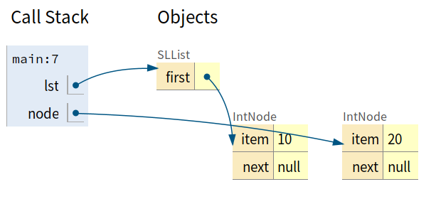
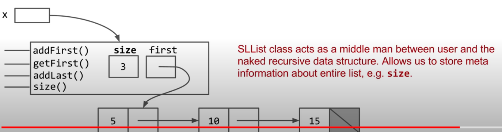
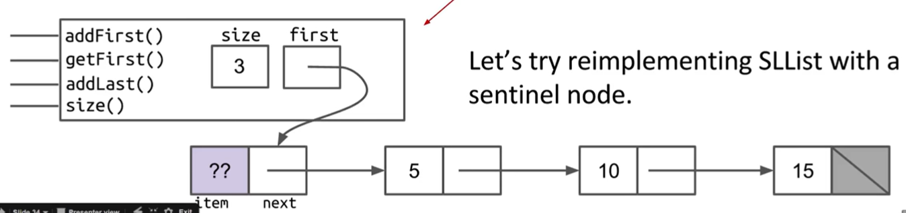

# Lists

在 Proj0 里有大量使用数组的代码，数组在 Java 中都是固定长度对的，无法被改变

Java 中有提供 Build-in 数组类型，本章的介绍重点


## Mystery of the Walrus

```java
Walrus a = new Walrus(1000, 8.3);
Walrus b;

b = a;
b.weight = 5;		// change b will affect a
System.out.println(a);
System.out.println(b);
```

这里面蕴含的运行逻辑可以帮助我们构建更强大的代码，更有效率的数据结构


### Bits

为什么会有上面不同影响的结果呢

因为 Java 有 8 大基本类型

```
[byte] [short] [int] [long] [float] [double] [boolean] [char]
```

当你在 Java 中声明一个特定变量之后，计算机会根据这个类型分配特定的存储空间，来存储这个变量

Java 会在内部维护一个表，完成每个变量名称对地址的映射

如果只是声明的话：Java 并不会在预留的空间内写入任何数据（安全起见，Java 不允许未初始化的变量被访问

> Tip：一个变量在内存的存储地址其实是超过了 `Java level of abstration accessible` 
>
> 在 Java 中无论使用何种方式都不可能访问到某个变量的具体地址（Java 有点废物啊...
>
> 这个 PDF 在狡辩这个 Java 特性是为了更好的性价比
>
> Donald Knuth：premature optimization is the root of all evil	过早优化是地狱的开始


#### GRoE/Golden Rule of Equals

赋值语句会把 `box(x)` 内的每一个 bit 都复制到 `box(y)` 中


### Reference Types

上面是针对一等数据类型的处理，其他的所有数据类型都是通过引用去处理的，包括数组


#### Object Instantiation

在对象的实例化过程中，Java 会先为这个类的每个实例变量分配出空间，然后给出默认值

`new` 关键字其实更像是声明在内存的哪里储存该变量，返回内存中的某一个地址


#### Reference Variable Declaration

引用类型不会关心内部具体需要多少内存空间，只会返回一个 64bit 的变量

```java
Walrus someWalrus;
someWalrus = null;		// 并没有进行地址分配 或者说本应该用来指向存储位置的指针目前是 null

Walrus someWalrus;
someWalrus = new Walrus(1000, 8.3);		// 通过 new 进行了空间分配
```

对引用进行拷贝复制只是拷贝了指向，共享同一片内存的内容


#### Box and Pointer Notation

在 Java 的可视化执行中，使用小格子表示内存分配的空间（指针可视化）


#### Resolving the Mystery of the Walrus

引用的拷贝只是指向同一个内存空间


#### Parameter Passing

函数的传参与引用如何结合起来，本质都是**值传递**，只不过引用传递的是地址，通过地址直接修改

函数有自己的局部函数帧，参数储存在局部函数帧中，相对于主函数的运行环境是独立的


#### Test My Understanding

```java
public class PassByValueFigure {
    
	public static void main(String[] args) {
		Walrus walrus = new Walrus(3500, 10.5);
		int x = 9;
		doStuff(walrus, x);	// walrus 引用	x 常量
		System.out.println(walrus);	// 改变
		System.out.println(x);		// 不变
	}
	
    public static void doStuff(Walrus W, int x) {
		W.weight = W.weight - 100;
		x = x - 5;
	}
}
```


### Instantiation of Arrays

实例化数组和其他类的实例化其实也没啥区别，都要使用 `new` 关键字

```java
int[] x;					// 单纯声明
new int[]{0, 1, 2};			// 单纯的分配了空间 然后立刻释放掉..(一瞬的生命)
int[] x = new int[]{0, 1};	// 包含空间分配

Walrus[] wal_list = new Walrus[2];	// 分配指定数量的 Walrus 数组
```

和其他类型不太一样的是，Java 只允许数组变量储存真实的内存地址（Java 本来是无法访问变量地址的）


### Law of the Broken Futon

[The Math Ceiling: Where’s your cognitive breaking point? – Math with Bad Drawings](https://mathwithbaddrawings.com/2015/04/08/the-math-ceiling-wheres-your-cognitive-breaking-point/) 

有一说一，这个小故事讲的挺好的，我自己也有这种经历，而且还就是指针学习，当时没理解虽然也能敲代码，但实际上是残缺的，我到后面慢慢又补起来才完全理解，那一刻真的是恍然大悟的感觉

上面讲的指针或者说引用我其实早就学了233（或者说自己悟了），但这种基础时不时复习一下还是挺好的


### Int Lists

链表，可变长度（其实就像是在 Python 里面做的那样）

```java
public class IntList {
    public int first;
    public IntList rest;	// type(next) = self
    
    public IntList(int f, IntList r) {
        // 声明构造方法
        first = f;
        rest = r;
    }
    
    public static void main(String[] args) {
        // 这样只能在前面添加元素
        IntList L = new IntList(15, null);
        L = new IntList(10, L);
        L = new IntList(5, L);
    }
}
```


#### Size and IterativeSize

为 `IntList` 添加一个 `size()` 方法，返回链表的长度

- `size()`：使用递归的方法返回长度
- `IterativeSize`：使用迭代的方法返回长度

```java
// my code here
public class IntList {
    public int first;
    public IntList rest;	// type(next) = self
    
    public IntList(int f, IntList r) {
        // 声明构造方法
        first = f;
        rest = r;
    }
    
    public static int Size(IntList L) {
        // 注意不能执行 L.rest 否则会有 NullPointerError
        if (L != null) {
            return 1 + L.Size(L.rest);
        }
        return 0;
    }
    
    public static int IterableSize(IntList L) {
        int length = 0;
        while (L != null) {
            length += 1;
            L = L.rest;
        }
        return length;
    }
}

// 有一说一 客观上我这么写可以运行 但是没有体现出 Java OOP 编程的思想
// 单纯的写了一个方法函数 和 Object IntList 都没关系了
// 只能说是 Python 的思想遗毒
```


##### 修订版

通过对象实例来调用 `L.size()` 而不是 `size(L)` 

```java
// my code here
public class IntList {
    public int first;
    public IntList rest;	// type(next) = self
    
    public IntList(int f, IntList r) {
        // 声明构造方法
        first = f;
        rest = r;
    }
    
    public static int size() {
        if (this.rest == null) {
            return 1;
        }
        return 1 + L.rest.size();
    }
    
    public static int IterableSize() {
        int length = 0;
        IntList ptr = this;
        while (ptr != null) {
            length += 1;
            ptr = ptr.rest;
        }
        return length;
    }
}
```


#### Get

获取特定位置的元素

```java
// my code here
public class IntList {
    public int first;
    public IntList rest;	// type(next) = self
    
    public IntList(int f, IntList r) {
        // 声明构造方法
        first = f;
        rest = r;
    }
    
    public int get(int index) {
        // 首先是针对特殊情况的处理
        if (index > this.size()) {
            return null;
        }
        IntList ptr = this;
        while (index) {
            ptr = ptr.rest;
            index -= 1;
        }
        return ptr.first;
    }
}
```


P47

#### Other Exercise

##### incrList（IntList L, int x）

对 L 的每个元素增加 x 的固定值，返回一个新列表

```

```


##### DincrList（IntList L, int x）

P48


# SLLists

这里强调了，上面声明的 `IntList Class` 其实很难使用，难以阅读并且难以维护（视频开个玩笑说这是裸体

（Java 并不是一门适用于函数式编程的语言，所以我们要给它穿衣服

根本原因：`IntList` 是通过递归实现的，导致使用者只能通过递归实现自己的函数功能

所以现在写个新的 `SLL Class` 


## Improvement


### #1 Rebranding

```java
// SLL
public class IntNode {
    public int item;
    public IntNode next;
    
    public IntNode(int i, IntNode n) {
        item = i;
        next = n;
    }
}
```


### #2 Bureaucracy

因为 `IntNode` 很难直接使用，所以在外面套一层 `SLList` 代替与用户的交互

```java
public class SLList {
    public IntNode first;	// 调用 IntNode 实现
    
    public SLList(int x) {
        first = new IntNode(x, null)
    }
}

// 相对于原本的声明方式隐藏了 null 的声明 hides the terrible truth
IntNode L1 = new IntNode(5, null);
SLList L2 = new SLList(5);
```

所以看上去没有用，但是还是有那么一点点用的


### #3 addFirst and getFirst

`addFirst()`：在链表的首位插入元素，类似在 `IntNode` 的实现 `L = new IntNode(5, L);` 这样

`getFirst()`：返回第一个元素

两个方法写在 `SLList Class` 中，因为使用了 `IntNode` 所以可以使用

```java
public class IntNode {
    public int item;
    public IntNode next;
    
    public IntNode(int i, IntNode n) {
        item = i;
        next = n;
    }
}
```

```java
public class SLList {
    public IntNode first;	// 调用 IntNode 实现

    public SLList(int x) {
        first = new IntNode(x, null);
    }

    // 这两个成员函数本质是在操作 IntNode_first
    public void addFirst(int firstValue) {
        first = new IntNode(firstValue, this.first);
    }

    public int getFirst() {
//        if (this.first == null) {
//            return null;
//        }
        return this.first.item;
    }
    // null 并不能算在 int type 里面
    
    public static void main(String[] args) {
        SLList L = new SLList(10);
        L.addFirst(5);
        System.out.println(L.getFirst());
    }
}
```

全部通过 `first` 这一个中间介质去访问


### #4 Public v.s. Private

目前在 `SLList Class` 中的 `IntNode` 是 `public` 权限，可以被外界访问，也就是可以绕过 `SLList` 访问

`public`：你需要保证这个函数可以永远按照它的设计持续运行

`private`：声明某段代码的实现可以被忽略，也不需要理解，修改起来也方便（不丢脸 

​					只能在当前的 `XXX.java` 文件中访问

```java
error: first has private access in SLList
```

（实际上通过 Java 的反射特性也能访问到 `private` 变量，这语言挺自相矛盾的）


### #5 Nested Classes

Java 每个类都会有一个单独的 `.java` 文件存储，在本节的代码示例中，`IntNode` 只是 `SLList` 类的支持类

Java 允许我们进行类的嵌套，把 `IntNode` 类写在 `SLList` 类内部（对代码表现没有什么特别影响，只是更整洁了

如果被嵌套的类 `IntNode` **没有使用**外部类 `SLList` 的**任何实例方法或变量**，可以用 `static` 修饰 `IntNode` 

> 注意返回值类型也算使用的

用 `static` 修饰 `IntNode` 那么无法访问 `first`，`addFirst` 和 `getFirst` 的变量和方法

> 可以节省一点内存，也就这样了
>
> 或者从代码结构上讲，更好理解，这个内部类只为外部类服务


Q：这里 `private` 和 `static` 的修饰有什么区别

如果其他类不应该访问这个 `nested class` 那么就设置为 `private` ，比如这个场景下只会被 `SLList` 类使用，就可以设置为 `private` ，核心是涉及到第三方类

而是否添加 `static` 只关系到内部类和外部类两个类

内部类：如果外部类有多个内部类，这些内部类之间**不可以**互相访问，除非先声明一个实例

[【Java 基础篇】深入理解 Java 内部类：嵌套在嵌套中的编程奇妙世界-腾讯云开发者社区-腾讯云 (tencent.com)](https://cloud.tencent.com/developer/article/2339186) 

```java
// 从外部访问 SLList 的内部类 IntList
public class Test {
    public static void main(String[] args) {
        // 创建 SLList 实例
        SLList sllist = new SLList(10);

        // 创建 IntNode 实例(通过 SLList 实例)
        // 这里根据下面的图也能看出 声明了一个新数列
        SLList.IntNode node = sllist.new IntNode(20, null);

        // 输出 IntNode 的值
        System.out.println("IntNode item: " + node.item);
        
        // 调用 SLList 的方法
        sllist.addFirst(30);
        System.out.println("First item in SLList: " + sllist.getFirst());
    }
}
```

> 确实可以欸，GPT 好厉害




### #6 addLast and size

首先提供了一份 `starter_code` 尤其强调了推荐递归实现

```java
public class SLList {
    public class IntNode {
        public int item;
        public IntNode next;

        public IntNode(int i, IntNode n) {
            item = i;
            next = n;
        }
    }

    private IntNode first;

    public SLList(int x) {
        first = new IntNode(x, null);
    }

    /** Adds an item to the front of the list. */
    public void addFirst(int x) {
        first = new IntNode(x, first);
    }

    /** Retrieves the front item from the list. */
    public int getFirst() {
        return first.item;
    }

    /** Adds an item to the end of the list. */
    public void addLast(int x) {
        /* Your Code Here! */

        // Error version: IntNode 的第一个参数必须是 int type
//        IntNode last = new IntNode(x, null);
//        first = new IntNode(first, last);	// Error

        // Correct
        IntNode ptr = this.first;
        while (ptr.next != null) {
            ptr = ptr.next;
        }
        ptr.next = new IntNode(x, null);
    }

    private static int nodeSize(IntNode lst) {
        if (lst.next == null) {
            return 1;
        }
        return 1 + nodeSize(lst.next);
    }

    /** 像这种外面套了一层的情况 有一种通用解决办法: Write a static helper method */
    public int size() {
        return nodeSize(this.first);    // 注意这里不需要额外传参 属于 SLList method
    }

    public static void main(String[] args) {
        SLList lst = new SLList(10);
        lst.addLast(15);
        System.out.println(lst.getFirst());
        System.out.println(lst.size());
    }
}
```


### #7 Caching

优化在上一个步骤中 `size()` 的实现，不然线性复杂度在处理大列表的时候会很绝望，优化到 `O(1)` 的复杂度

最简单的方法就是在 `SLList Class` 中直接添加一个变量 `size` （空间换时间的一种缓存思想）

在 `SLList` 中额外开辟一个空间记录 `IntNode` 列表的属性，对比如果没有 `SLList` 在外面套一层，`size` 这个变量就要直接写到 `IntNode` 里面，无论是存储在哪里，增减元素的时候都会变得很麻烦，而 `SLList` 就不会这样




### #8 The Empty List

`SLList` 除了给用户提供了使用遍历和提高 `size()` 运行时间，还有一个好处就是创造空列表

> 这个其实能回想起在 CS61A 中的 Scheme_Proj 里面也是有一个空类，通过构造函数声明出来
>
> 后续判断都是通过与这个空类去比较

```java
public class SLList{
    private IntNode first;
    private int size;
    
    public SLList() {
        this.first = null;
        this.size = 0;
    }
    
    public SLList(int x) {
        this.first = new IntNode(x, null);
        this.size = 1;
    }
}
```

```java
/** Adds an item to the end of the list. */
public void addLast(int x) {
    this.size += 1;
    /* Your Code Here! */
    if (this.first == null) {
        this.first = new IntNode(x, null);
        return;
    }
    IntNode ptr = this.first;
    while (ptr.next != null) {
        ptr = ptr.next;
    }
    ptr.next = new IntNode(x, null);
}
```


### #9 Sentinel Nodes

> Sentinel 哨兵

这里认为刚刚的实现有点丑陋，所以提出了一个哨兵的概念，让实现优雅一点

人类的大脑是有极限哒！所以要尽可能的抽象代码（这个例子里面的特殊情况还很少，涉及到更复杂的就会很丑陋

有点像是那种防止访问异常的头节点的存在，使无论是否空的列表都有相同的结构



```java
SLList sentinel = new SLList();		// 对属性 first 进行替换
public class SLList{
    private int size;
    private IntNode sentinel;	// the real first node is at sentinel.next
    
    public SLList() {
        this.sentinel = new IntNode(516, null);	// 这里的第一个参数数值其实不重要啦
        this.size = 0;
    }
    
    ...
    public SLList(int x) {
        // 利用 sentinel 构建新的列表
        this.size = 1;
        
        // 方向错了
        this.sentinel = new IntNode(x, this.sentinel);
        
        // Error
        // 注意这里的构造和 SLList() 的构造是分离的 无法访问到 sentinel(516) 列表
        IntNode lst = new SLList(x);
        this.sentinel.next = new IntNode(this.sentinel, lst);
        
        // correct
        // 同样需要手动声明一个头结点
        this.sentinel = new IntNode(516, null);
        IntNode first = new IntNode(x, null);
        this.sentinel.next = first;		// 把指针改过去就行
    }
    
    public void addFirst(int x) {
        // 这里也要修改 注意新添加的元素不能插到 sentinel 前面 不然结构会混乱
        this.sentinel.next = new IntNode(x, this.sentinel.next);
        this.size += 1;
    }
    
    public int getFirst() {
        return this.sentinel.next.item;
    }
    
    public void addLast(int x) {
        // 核心: 省略了对 IntNode_null 的判断
        this.size += 1;
        IntNode ptr = this.sentinel;	// key
        while(ptr.next != null) {
            ptr = ptr.next;
        }
        ptr.next = new IntNode(x, null);
    }
}
```

> 视频里提示说强烈推荐 Proj1 用这种方法，Get了


## Invariants

Invariant 不变值，常量，或者被认为永远是正确的

在这个项目代码中，至少有 3 个值是常量：

1. 指向 `sentinel` 的指针
2. 列表元素的第一个元素的位置永远在 `this.sentinel.next` 
3. `size` 数值永远是执行 `addFirst()` 或者 `addLast()` 的次数和


# Done!

总结一下，为什么命名为 `SLList` 呢，因为 `sentinel` 2333


