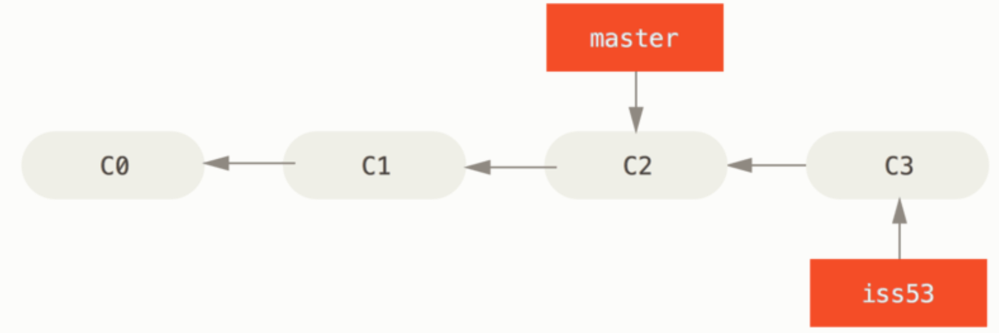
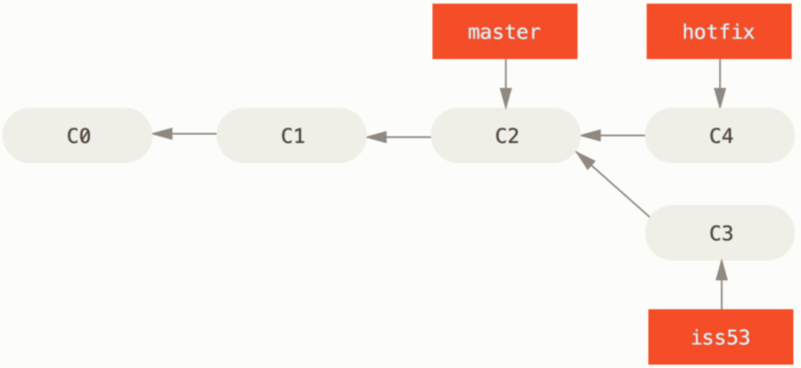
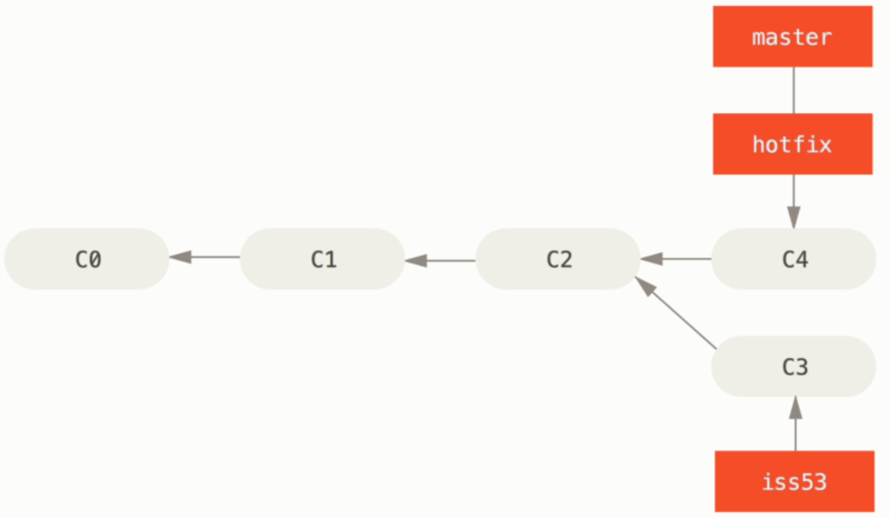
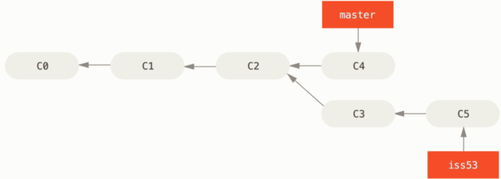
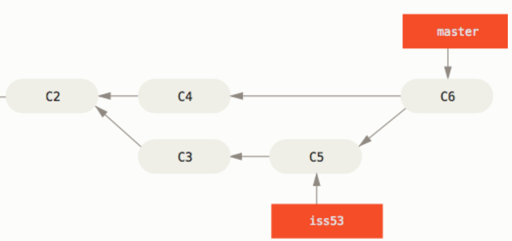

## A: Intro to Version Control System

Git 是一个分布式版本控制系统，每个开发者的电脑上都保存了整个项目全部的历史记录（包括旧版本）

#### Repository

整个项目的整个历史被称为一个 Repository，因为是本地存储的，所以可以在本地使用 Git，甚至不需要联网

（所以 GitHub 和 Git 其实没关系，只是一个服务器，所有在线仓库的一个用户罢了


## B: Local Repositories

注意 **Github != Git** （使用 Git 本身并不会用到 `git push` 命令


首先是先创建一个文件夹，然后把该文件夹作为本地仓库，进入该文件夹内部，创建一些文件

```shell
cd repo_file
touch Asuka.txt
touch ShinJi.txt
```


总之在创建一些文件后，声明该文件夹作为 Git 仓库

```shell
git init
```


创建本地仓库，但是此时还没有在 Git 仓库中添加任何文件

```shell
git add Asuka.txt	# 实际上是把 Asuka.txt 文件添加到 <track file> 中
```

单独添加一个文件其实是有的时候不需要跟踪所有文件，通过 `add command` 命令可以告诉 Git 它该追踪哪些文件


此时检查 Git 的状态

```shell
git status		# 能看到 new file: Asuka.txt 等待 commit(同时还会显示未追踪的文件 ShiJi.txt)
```


上传文件（把文件放入保险箱中

```shell
git commit -m "Eva"
```

只要不是世界毁灭，行星爆炸（，硬盘损坏），就可以认为是完全安全的


再次查看状态

```shell
git status	# 此时会显示 clean tree
git log		# 此时会显示出曾经的提交记录	可以看到上一次的 commit 号和时间
```


更激进一点的，可以查看内容，这行命令没什么实际意义，反正也看不懂，只是看看 Git 的快照功能

```shell
git show	# 不是人类能看懂的语言
```


修改已经放入保险箱的文件

```shell
vim Asuka.txt

# 尝试提交修改
git commit -m "changed Asuka.txt"		# 事实上 Git 无法进行提交
# Changes not staged for commit
```

为什么会无法提交呢，因为虽然这个文件之前通过 `git add` 添加到了追踪列表中，但是并没有改变它的状态，导致 Git 不知道这个文件被修改了

```shell
git add Asuka.txt
git commit -m "changed Asuka.txt"	# sucess!
git log		# 此时可以发现有 2 个提交了
```


在修改文件后想回到上一次提交再修改

```shell
git log		# 通过查看提交的版本号 找到目标提交号 commit_num
git checkout commit_num ./Asuka.txt

... file changing...

# 二次提交	提交记录并不会覆盖
git commit -m "Reverse Change"		# 并不需要使用 git add 因为 checkout 自动进行了一次 add

# 查看第三次的提交
git log
```


## C: Local Repositories

[Git - Recording Changes to the Repository (git-scm.com)](https://git-scm.com/book/en/v2/Git-Basics-Recording-Changes-to-the-Repository) 终于看完了，我回来了

剩下的内容就是对官方文档的总结，具体见附录


#### Undoing changes

这个是比较特殊的，上面的官方文档中没有提到的（这个是新的文档，也写在附录中

```shell
git reset HEAD [file]
```


## D: Remote Repsitories

此时才到 Github 出场的时候 []~(￣▽￣)~*


```shell
git clone [remote-repo-URL]

git remote add [remote-repo-name] [remote-repo-name]

git remote -v		# 显示 Git 以短名存储的 URL
git remote --verbose

git pull [remote-repo-name] master

git push [remote-repo-name] master
```

命令 `git remote -v` 是列出所有可用的远程连接，通常如下面的输出结果

```shell
# 通常同一个仓库会出现两次
origin  git@github.com:Zazzle516/CS61A-code.git (fetch)		# 获取
origin  git@github.com:Zazzle516/CS61A-code.git (push)		# 输出
```


## E: Git Branching

不同世界线的分支！欺骗世界吧！


#### Reasons for Branching

- 重构代码的时候，但是不能影响已经存在的代码继续运行
- 准备完成项目的新要求，但是不确定这个要求是否能完成
- 合作完成项目的时候

请自由的创建分支，直到达成你的目的然后与主分支合并（事实上 Git 是通过图的方式去记录历史） 

同时在附录中也有说明 **Basic Branching and Merging** 


#### Creating, Deleting and Switching Branches

```shell
git branch -v		# 查看自己当前处于哪个分支上
```


#### Merging and Conflict

详见附录


## F: Other Git Features

### Git Stash

#### 应用场景

修改了一个文件，想回退更改但是又担心之后要查看它的代码，所以就是像保存但是又不想增加一个脏的提交

（拒绝把自己的 NT 代码给别人看，这个代码真的很实用）


#### 原理

保存到一个未完结变更的堆栈（本地）中，随时可以重新应用，执行命令后的 Working_Directory 和上一次提交是一模一样的，恢复时执行 `git stash apply` 就可以，Git 允许保留多个缓存版本，指定恢复环境


#### 执行

```shell
git stash save "first-stash"

# 恢复之前缓存的工作环境同时删除之前的缓存版本
git stash pop

# 恢复之前的缓存的工作环境同时保留该缓存版本
git stash apply

# 指定恢复缓存的版本
git stash apply "first-stash"	# 默认使用最近的一个版本

# 查看当前的本地缓存版本
git stash list

# 从 stash 创建分支
git stash branch new_branch_name	# 这个没太理解
```


#### 实践

```shell
24056@Zazzle-Laptop MINGW64 /d/git_test
$ git init
Initialized empty Git repository in D:/git_test/.git/

24056@Zazzle-Laptop MINGW64 /d/git_test (master)
$ touch test.txt

24056@Zazzle-Laptop MINGW64 /d/git_test (master)
$ cat test.txt

24056@Zazzle-Laptop MINGW64 /d/git_test (master)
$ echo "Hello">>test.txt

24056@Zazzle-Laptop MINGW64 /d/git_test (master)
$ cat test.txt
Hello

24056@Zazzle-Laptop MINGW64 /d/git_test (master)
$ git add test.txt
warning: in the working copy of 'test.txt', LF will be replaced by CRLF the next time Git touches it

24056@Zazzle-Laptop MINGW64 /d/git_test (master)
$ git commit -m "first commit"
[master (root-commit) 366f27c] first commit
 1 file changed, 1 insertion(+)
 create mode 100644 test.txt

24056@Zazzle-Laptop MINGW64 /d/git_test (master)
$ echo "World">>test.txt

24056@Zazzle-Laptop MINGW64 /d/git_test (master)
$ cat test.txt
Hello
World

24056@Zazzle-Laptop MINGW64 /d/git_test (master)
$ git stash save "world"
warning: in the working copy of 'test.txt', LF will be replaced by CRLF the next time Git touches it
Saved working directory and index state On master: world

24056@Zazzle-Laptop MINGW64 /d/git_test (master)
$ cat test.txt
Hello

24056@Zazzle-Laptop MINGW64 /d/git_test (master)
$ echo "Second">>test.txt

24056@Zazzle-Laptop MINGW64 /d/git_test (master)
$ git stash save "Second"
warning: in the working copy of 'test.txt', LF will be replaced by CRLF the next time Git touches it
Saved working directory and index state On master: Second

24056@Zazzle-Laptop MINGW64 /d/git_test (master)
$ git stash list
stash@{0}: On master: Second
stash@{1}: On master: world

# 注意这里的报错! 一定要通过 stash@{k} 的方式去恢复
24056@Zazzle-Laptop MINGW64 /d/git_test (master)
$ git stash apply World
error: World is not a valid reference

24056@Zazzle-Laptop MINGW64 /d/git_test (master)
$ git stash apply stash@{1}
On branch master
Changes not staged for commit:
  (use "git add <file>..." to update what will be committed)
  (use "git restore <file>..." to discard changes in working directory)
        modified:   test.txt

no changes added to commit (use "git add" and/or "git commit -a")

24056@Zazzle-Laptop MINGW64 /d/git_test (master)
$ cat test.txt
Hello
World

24056@Zazzle-Laptop MINGW64 /d/git_test (master)
$
```


### Git Rewriting History

[Git - Rewriting History (git-scm.com)](https://git-scm.com/book/en/v2/Git-Tools-Rewriting-History) 修改本地的提交历史

只要在文件仍然在暂存区的期间，Git 仍然允许你决定哪个文件可以提交，也可以自由的修改本地提交记录

```shell
git commit != git push
```


#### Changing the last commit

通常是修改一下提交信息或者改一下文件，统一使用这个命令

```shell
git commit --amend		# 加载上一次的提交信息并进入一个编辑框 让你重新修改
						# 如果是修改文件也同理
						
# 如果只是改内容不想改提交信息的话
git commit --amend --no-edit
```


#### Changing Multiple Commit Messages

修改历史长河中的过去的一个提交，Git 没有提供直接的方法，但是可以使用 `rebase` 工具间接达成，把当前的指针切换到目标提交，后续通过 `git commit --amend` 完成修改

但是修改的范围中间不能包括上传到 GitHub 上的，否则会怪怪的

```shell
# para: the parent of the last commit you want to edit
git rebase -i para

# 修改前三次提交
git rebase -i HEAD~3

# 修改的提交会以倒叙的方式呈现出来  old -> new
[action] f7f3f6d Change my name a bit
[action] 310154e Update README formatting and add blame
[action] a5f4a0d Add cat-file

# 针对每个 commit 可以执行不同的操作 action
p, pick <commit> = use commit	# 不执行任何修改

r, reword <commit> = use commit, but edit the commit message
e, edit <commit> = use commit, but stop for amending
s, squash <commit> = use commit, but meld into previous commit
f, fixup <commit> = like "squash", but discard this commit's log message
x, exec <command> = run command (the rest of the line) using shell
b, break = stop here (continue rebase later with 'git rebase --continue')
d, drop <commit> = remove commit
l, label <label> = label current HEAD with a name
t, reset <label> = reset HEAD to a label
m, merge [-C <commit> | -c <commit>] <label> [# <oneline>]

# 以上面列出的提交为例
edit f7f3f6d Change my name a bit	# 脚本执行到该 commit 停下
pick 310154e Update README formatting and add blame
pick a5f4a0d Add cat-file

# 保存退出编辑器后 Git 执行
$ git rebase -i HEAD~3
Stopped at f7f3f6d... "Change my name a bit"
You can amend the commit now, with

       git commit --amend

Once you're satisfied with your changes, run

       git rebase --continue
```


#### Recording Commits

利用 Rebase 提供的各种功能，其实可以完全修改整个提交的顺序

```shell
pick f7f3f6d Change my name a bit
pick 310154e Update README formatting and add blame
pick a5f4a0d Add cat-file

# 比如想要移除某次提交 单纯的把它从修改列表中删掉就可以
# 修改顺序

pick 310154e Update README formatting and add blame
pick f7f3f6d Change my name a bit
```

但是注意这个提交就完全消失了！！！


#### Squashing Commits

```shell
# 三合一! 我将发动融合攻击！
pick f7f3f6d Change my name a bit
squash 310154e Update README formatting and add blame
squash a5f4a0d Add cat-file
```


#### Splitting a Commit

对其中一个提交可以撤销，然后拆分出任意你想要的次数进行提交

注意会修改该拆分分支后续的提交的 SHA-1 的计算结果

```shell
# 首先先停在该提交处
edit 310154e Update README formatting and add blame

# 把该提交拆分为 1.Update README formatting	2.add blame

# undo the commit and leave the unmodified files unstaged
git reset HEAD~

# 1. Updated README formatting
git add README
git commit -m 'Update README formatting'

# 2. add blame
git add lib/simplegit.rb
git commit -m 'Add blame'

# 完成切分 返回 rebase 执行
git rebase --continue
```


#### Deleting a Commit

使用 `drop action` 即可

由于 Git 的存储原理，删除或者修改一次提交，会导致该提交后续的所有提交的修改，你越往前修改，后续的 Git 提交修改越多（事情逐渐朝着不可控的方向滑去.....）

```shell
# 及时放弃对过去提交的修改 这才是能救你的命令
git rebase --abort

# 假如你犯贱 已经修改了但是后悔了
git reflog
```

[Learn to change history with git rebase! (git-rebase.io)](https://git-rebase.io/) 


#### Nuclear Option: filter-branch

因为使用 `git rebase` 命令在修改远古提交的时候实际是很麻烦也很危险的，如果你非要重写一个大范围的历史提交记录，可以考虑使用 `git filter-branching` 命令

现在更推荐使用 `git-filter-repo` 命令，调用 Python 脚本执行，原本的 Git 命令实际上有点坑

> [newren/git-filter-repo: Quickly rewrite git repository history (filter-branch replacement) (github.com)](https://github.com/newren/git-filter-repo) 

基于一些常见场景做一些介绍


##### Removing a File from Every Commit

比如你不经思考的提交了一堆二进制文件，比如 Antlr4 的自动生成文件之类的

```shell
git filter-branch --tree-filter 'rm -f password.txt' HEAD

# 指令模板
git filter-branch --tree-filter 'rm -f file_name' HEAD

# 在所有分支上生效
git filter-branch --tree-filter --all 'rm -f file_name' HEAD
```

一般来说，推荐在测试分支上完成，如果成功没有问题了，把该分支的内容强制覆盖到主分支上


##### Making a Subdirectory the New Root

修改项目的根路径，Git 同时会**移除对该根路径的文件没有作用的提交** 

```shell
git filter-branch --subdirectory-filter root_file HEAD
```


##### Changing Email Address Globally

这行命令执行下去会修改每个提交的 SHA-1 计算值，有点长，感觉用不到几次，知道就好

```shell
$ git filter-branch --commit-filter '
        if [ "$GIT_AUTHOR_EMAIL" = "schacon@localhost" ];
        then
                GIT_AUTHOR_NAME="Scott Chacon";
                GIT_AUTHOR_EMAIL="schacon@example.com";
                git commit-tree "$@";
        else
                git commit-tree "$@";
        fi' HEAD
```


> 后面的内容我只准备自己看看了，不记笔记了

### Git Rebasing

[Git - Rebasing (git-scm.com)](https://git-scm.com/book/en/v2/Git-Branching-Rebasing) 

这个合并思路和 `git merge` 是相反的，比如把子分支的代码合并到主分支，`git merge` 是先切换到主分支，执行 `merge` 合并子分支的代码，而 `git rebase` 是切换到子分支，执行 `git rebase master` 

`git rebase` 的合并实际上是基于两个分支共同的祖先，会先把子分支上所有不同保存到一个暂时文件中，然后切换分支，把所有改动作用生效（注意此时生效的只有子分支的内容，还没有与主分支进行合并）

```shell
git checkout master
git merge sub-branch
```


`git rebase` 的结果相对 `git merge` 没有任何区别，只是提交记录更干净，看上去像是线性的历史

核心还是在你写代码的时候脑子要清楚你写的是哪部分，会不会有冲突


Q：在把 `cilent-branch` 合并到 `master-branch` 上的时候，C3 起了什么作用

因为实际的合并代码，并没有涉及 C3 的代码		？？？？？需要自己测试一下


### Git Reset

[Git - git-reset Documentation (git-scm.com)](https://git-scm.com/docs/git-reset.html) 


### Git Revert

[Git - git-revert Documentation (git-scm.com)](https://git-scm.com/docs/git-revert.html) 


### Git Cherry Pick

[Git - git-cherry-pick Documentation (git-scm.com)](https://git-scm.com/docs/git-cherry-pick.html) 


## G: Remote Repositories

这里简单介绍一些和远程仓库的交互


### Git Command

```shell
# short-name: origin
git remote add [short-name] [remote-url]

# 改名(在 Github 上用 GUI 改更人性化)
git remote rename [old-name] [new-name]

# 删除仓库
git remote rm [remote-name]

# 推送到远端仓库的特定分支
git push [remote-name] [remote-branch]

# 更新本地对远端的副本 但是并不会和你的代码合并	主要是防止后续的合并冲突
git fetch [remote-name]		# 和 git pull 的讨论在下面的 QA
```


Q：`git fetch` 和 `git pull` 有什么区别

Git 实际上会保存两个版本的仓库：本地仓库和远端仓库（这里的**远端是一种概念意义**，强调两个仓库版本不同）

`git fetch`：将远端仓库的最新内容拉到本地仓库，由用户检查后决定是否更新

`git pull`：直接合并，可能产生冲突要手动解决，从效果上来说 = `git fetch` + `git merge` 


## H: Remote Repository Exercise

Sad...no partner(///￣皿￣)○～我自己看一下流程吧，就是互相写文件，造成冲突然后解决的过程


## I: Conclusion

针对 Github 的一些功能进行一些资料分享

[Fork a repository - GitHub Docs](https://docs.github.com/en/pull-requests/collaborating-with-pull-requests/working-with-forks/fork-a-repo) 

[Syncing a fork - GitHub Docs](https://docs.github.com/en/pull-requests/collaborating-with-pull-requests/working-with-forks/syncing-a-fork) 

[About pull requests - GitHub Docs](https://docs.github.com/en/pull-requests/collaborating-with-pull-requests/proposing-changes-to-your-work-with-pull-requests/about-pull-requests) 

[About issues - GitHub Docs](https://docs.github.com/en/issues/tracking-your-work-with-issues/about-issues) 


## J: Advanced Git Features

如何利用 GitHub 提供的一些便携指令来简化 Git 处理流程


# 附录

## Staged

[Git三大特色之Stage(暂存区)_git stage-CSDN博客](https://blog.csdn.net/qq_32452623/article/details/78417609) 

理论上，即使你在提交的时候，不去进行 `git add` 处理，也可以把修改提交上去，但是 Git 无法检测到你的修改

也就是，`git commit` 检测的文件和实际存储的文件并不是一个文件，`git commit` 检测的文件存储在 **暂存区** 


### Git Section

Git 的本地数据管理可以分为 3 个区：工作区，暂存区，版本库

#### Working Directory

打开文件的地方，文本啊，VS 啊之类的


#### Stage

数据暂时存放的地方，可以在工作区和版本库之间进行数据交流


#### Commit History

存放已经提交的数据，`git push` 的执行内容


#### Work Flow

第一次 `git add` 操作同步 Working_Directory 和 Stage 的内容，第二次 `git commit` 操作同步 Commit History

通过一个暂存区给挽回错误操作带来了可能性

```
1. developer
2. Working_Directory -> add -> Stage -> commit -> Commit_History
3. RemoteRepository
```


## Recording Change

对 C 部分的 Git 官方链接进行一些说明，关于 Git 如何判断文件改变 [Git - Recording Changes to the Repository (git-scm.com)](https://git-scm.com/book/en/v2/Git-Basics-Recording-Changes-to-the-Repository) 

在工作环境（repo）中每个文件只有两个状态，`tracked` 或者 `untracked` 状态

- Tracked File：在上一个快照中的文件，还包括新添加的文件，可能是未修改的，修改的，暂存的
- Untracked File：不在上一个快照并且不在暂存区的文件（可以是曾经的快照中未修改的文件）

当你拷贝了一个仓库了下来，此时仓库中的所有文件都属于 `Tracked Files` 并且是未修改状态，因为 Git 刚刚检查过，并且你也没有修改任何文件

```shell
# 查看 master 分支下正在跟踪的文件
git ls-tree -r master --name-only
```


#### Tracked Files

只要曾经对该文件使用过 `git add` 该文件**永远也回不到** `Untracked` 状态

注意图中的 `remove` 操作只能从 `Unmodified` 状态开始


```shell
mkdir GitTest
cd GitTest
git init
touch a.txt
touch b.txt

git ls-tree -r master --name-only	# 无结果 此时还没有任何文件添加进 Git
git add .
git commit -m "First"

git ls-tree -r master --name-only	# 此时查看可以看到  a.txt  b.txt

echo "Hello">>a.txt		# 命令不一定对 反正就是修改 a.txt

git add a.txt
git commit -m "Test A file"
git ls-tree -r master --name-only	# 此时仍然可以看到  a.txt  b.txt

# 再次修改 a.txt
echo "World">>a.txt
git add a.txt
git commit -m "Second A file change"

git ls-tree -r master --name-only	# b.txt 是一直存在的
```


### Staging Modified Files

`git add` 除了声明文件追踪还有很多其他的功能，还可以把文件放到缓存区，标记合并（解决文件冲突），其实更准确的描述是 `add precisely this content to the next commit` 

如果在执行 `git add` 后又修改了文件，必须重新执行 `git add` 因为新修改的内容没有放入缓冲区，无法识别


### Short Status

```shell
git status -s	# git status 的简化版本
```

文件状态标识：

- Untracked File：有个 `??` 在左边
- new added File：有个 `A` 在左边     （如此类比其他标识


### Ignoring Files

便于项目管理而产生的 `.gitignore` 文件，一般自己从零开始创建 Git 仓库的话没有，需要自己新建，但是 IDEA 之类的集成环境会自动帮你配置好（一般是日志文件，临时文件，工具生成文件之类的）

> 不过注意：`gitignore` 文件只能适用于还没有被加入追踪的文件，一旦已经追踪了，即使添加到 `gitignore` 中也没用了（这点我有深刻教训

```shell
*.[oa]	# 告诉 Git 忽视以 .o 和 .a 结尾的文件
*~		# 忽视所有以 ~ 结尾的文件		比如 Word 用来标识缓存文件
```

关于 `gitignore` 文件书写的一些规则：

- 注释通过 `#` 标识
- `gitignore` 文件的每个配置项单独占一行，最简单的方式就是直接把文件名写进去
- 稍微复杂一点到正则表达式匹配
  - 如果 `gitignore` 文件放在项目根目录（绝大多数情况），则开头的 `/` 表示只能匹配根目录的，如果开头没有 `/` 则会在任何目录开始匹配
  - 如果 `/` 放在末尾，则表示只匹配目录
  - 使用 `!` 表示该文件会被重新包含（但同时如果它有上级目录的话，上级目录也需要是被包含的状态
  - `**` 用于匹配多级目录，比如 `a/**/b` 可以表示 `a/b` 或者 `a/x/../b` 这样


#### Ignore Case

- 忽略所有内容

  ```shell
  *
  ```

- 忽略所有目录

  ```shell
  */		# 注意表示目录的 / 是在末尾
  ```

- 忽略某路径下的所有文件，除了某个特定文件

  ```shell
  file_Directory/*		# 声明并不是文件夹本身
  !file_Directory/special_file_name
  ```

- 只保留特定目录下某个特定名称的所有文件

  ```shell
  /*						# 忽略所有目录
  !/file_Directory/		# 保留根目录下的特定目录	(根目录本身的信息一定会被保留
  
  /file_Directory/*
  !/file_Directory/a?z.*	# 保留 a 开头 z 结尾的任意后缀文件
  ```

  

#### Ignore Check

如何判断自己写的 `ignore` 文件是否正确生效

```shell
git check-ignore -v {文件或目录路径}

# -v 查看该文件是通过哪条文件忽略掉的
# 如果有相应的输出 说明被忽略了
```


#### Add then Ignore

遇到了最不幸的情况，先加入了版本管理但是现在想忽略

```shell
fix .gitignore file

git rm -r --cached .	# 清除本地缓存
git add .				# 重置跟踪文件
```


#### Ignore then Add

相对不幸的情况，先前忽略了现在想加入（但是解决办法是相同的

```shell
fix .gitignore file

git rm -r --cached .	# 清除本地缓存
git add .				# 重置跟踪文件
```


### Git diff

这个命令主要用来查看有哪些内容是你改了但是还没有提交到缓存区的，以及有哪些你提交到缓存区但是还没有提交的，虽然可以通过 `git status` 查看对应的文件名，但是 `git diff` 更具体到文件内容

```shell
git diff	# compare Working_Directory and Staging_Area

git diff --staged	# compare stage changes to the last commit
					# 相对于上次提交的内容中 本次的缓存区的内容的不同	
git diff --cached	# 和 --staged 等效命令
```

因为 `git diff` 本身是写给计算机看的，人本身是读不懂的，所有会有一些 `diff tools` 辅助

```shell
git difftool
```


### Git commit

```shell
git commit				# 进入编写信息的正式界面

git commit -m "msg"		# 编写信息的快捷方式

git commit -v			# 同时打印具体的修改内容
```


### Skipping the Staging Area

强烈不建议

```shell
git commit -a	# Git automaticlly stage every file that tracked
```


### Removing Files

在上面的两种 "绝望情况" 中已经讨论过

```shell
git rm XXX		# Git 会提示: deleted
				# 后续要是想添加进来需要 -f 强制命令
```


## Undoing Changes

尽管撤回工具很多，但请还是注意小心操作，毕竟这是 Git 少数几个真的会丢失数据的部分


### Redo Commit

当你提交过快，忘了改一些文件之类的，注意这个命令只能在本地作用，一旦上传到远端仓库就没办法了

```shell
git commit -m "first"	# 失败提交
git add forgotten_file

git commit --amend		# 使用当前的暂存区内容并提交 覆盖上一次的提交

# 两次提交最终表现为只有一次提交
```

不要乱用这个命令（仅限于微小修改，防止提交太过零碎）


### Unstaging a Staged File

把某个文件撤出暂存区

```shell
git reset HEAD <file>	# 注意在其他情况下使用 reset 是相对危险的 尤其是 -f 的情况
```


### Unmodifying a Modified File

恢复当前 Working_Directory 中特定文件的修改

```shell
git checkout -- <file>	# 注意中间的空格	同样是个危险的命令 因为本地修改全部消失
```

轻易不要用这个，因为只要是 `commit` 过的几乎都是可以恢复的，除非没有 `commit` 


### Undo with Git Restore

```shell
git restore		# 现在通常用 restore 取代 reset 执行
```


#### Unstaging a Staged File

```shell
git restore --staged <file>		# 同样注意中间有空格哦
```


#### Unmodifying a Modified File

```shell
git restore <file>	# 同理
```


## Basic Branching and Merging

这里 Git 官方给出的指导是模拟一个场景，然后在这种 Git 场景下如何进行 Git 操作


### Basic Branching

初始状态：`master branch` 

现在，为了解决 `#53` 号问题（不然就被裁），需要创建一个新的分支并同时进行切换

```shell
git checkout -b iss53		# 注意这里对 branch 的命名方式

git branch iss53
git checkout iss53
```

此时你有了两个指针，但是项目的内容是一直在前进的



然后，此时，出现了 `bug` !!!，当然是个小 bug，但是这个可以在 `master-branch` 直接 `hotfix` 改好

所以现在要做的就是切换到 `master-branch` 改好再切回来

```shell
# 记得把当前分支的修改全部提交后再切换哦 不然 Git 会拒绝你
git status
>> working_tree clean

git checkout master
```


虽然是 `hotfix` 但也是创建了一个分支去修改的

```shell
git checkout -b hotfix
... fix ...		# 确定修改好了之后
```



把 `hotfix-branch` 与 `master-branch` 合并

```shell
git checkout master
git merge hotfix
# 此时 master-branch 和 hotfix-branch 指针指向同一个提交
```



鉴于修改已经部署到 `master-branch` 上，这个 `hotfix-branch` 可以删了

```shell
git branch -d hotfix

git checkout iss53		# 回到分支继续工作
```


> 接下来是重点哦o(*￣▽￣*)ブ

### Basic Merging

此时继续在原来的 `iss53-branch` 上修改，此时的指针如下



此时执行合并会有一些不同的提示

```shell
git checkout master

git merge iss53
# Merge made by the 'recursive' strategy
```


为什么呢，因为此时两个分支的指针的**父指针并不相同**，实际上 Git 是使用了两个快照内容进行合并

此时这种合并是有**可能造成冲突**的


**合并结果如下：** 



```shell
git branch -d iss53
```


### Basic Merge Conficts

如果你修改了两个分支中同一个文件中的同一个代码部份，Git 是无法自动帮你合并的，因为父指针的指向不同

此时执行 `git merge iss53` 会发生合并冲突，并且提示如下信息

```shell
CONFLICT (content): Merge conflct in XXX <file>
Automatic merge failed; fix conflicts and then commit the result
```


发生合并冲突后如何手动解决

```shell
git commit

<<<<<<<		# where you run git merge

=======		# 分隔符

>>>>>>>		# the branch that merged

# 返回项目文件中修改

git status	# 再次查看发现没有冲突
```

> 虽然现在大部分情况都是通过 IDEA 解决的
